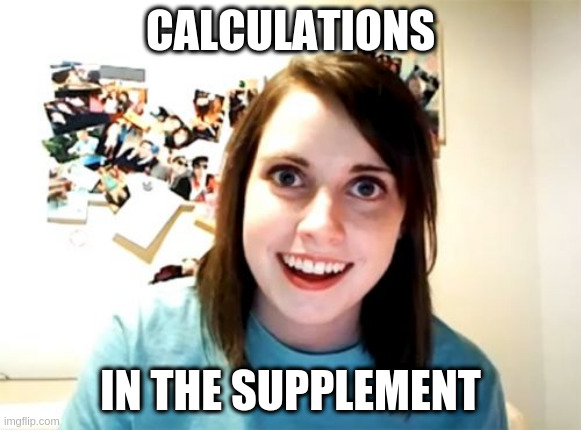

How to measure selection on pathogen evasion
========================================================
author: Richèl J.C. Bilderbeek
date:
autosize: true

[https://github.com/richelbilderbeek/mimy_presentation_20200729](https://github.com/richelbilderbeek/mimy_presentation_20200729) 

Libraries
========================================================

The Bianchi, Bilderbeek, Bogaart Question:


```r
library(bbbq)
library(pureseqtmr)
library(testthat)
```


```r
cat(1 + 1)
```

```
2
```


***


Arms race: detection
========================================================


Research question
========================================================

Do pathogens evolve to avoid host detection?


Natural selection in pathogens
========================================================

There are loci that are strongly selected upon [1]

***


No natural selection on host evasion
========================================================

We cannot detect natural selection on host evasion
from full genomes [2].

***


Sure!
========================================================

 * Vital loci are rare
 * Vital loci differ
 * Selection on detecting rare$^2$ loci is unlikely

Therefore, detection of vital loci is unlikely

***


Transmembrane helices
========================================================

 * TMHs are general structures that all hosts and pathogens have
 * Hence, selection on TMHs is more likely

Can we detect this?

***


Detect
========================================================

Transition|$n_{obs}$|$p$
----------|---------|----
D -> D    |?        |?
D -> U    |?        |?
U -> D    |?        |?
U -> U    |?        |?

***

 * $n_{obs}$: number observed
 * $p$: chance we observe this

If $p < 0.05$, we claim there is selection working upon it

Measure oserved number
========================================================

 * Take a strong dataset
 * Count the state transitions

Transition|$n_{obs}$|$p$
----------|---------|---
D -> D    |350      |?
D -> U    |200      |?
U -> D    |100      |?
U -> U    |350      |?

***


Measure the chance we observe this
========================================================

Given a focal TMH AA sequence


```r
f <- paste0(
  "CMIGFVIYLLFGFI",
  "LSLMCVFVLFVILILI"
)
expect_true(is_tmh(f))
```

and haplotype ...


```r
h <- "HLA-B*27:05"
```

***

... we can predict if it is detected:


```r
cat(is_detected(f, h))
```

```
FALSE
```

Predict
========================================================

And we can predict the chance a mutant will be detected:


```r
cat(calc_p_det_tmh_mut(f, h, n_adjancent_sequences = 20, percentile = 0.1))
```

```
0.07136226
```

Thus, 3% chance of a state transition.

We can do that for all TMHs!

Example results
========================================================

Transition|$n_{obs}$|$p$
----------|---------|---
D -> D    |350      |$0.7$
D -> U    |200      |$0.3$
U -> D    |100      |$0.4$
U -> U    |350      |$0.6$

$\mathcal{H}_0$: No/weak selection

***

Transition|$n_{obs}$|$p$
----------|---------|---
D -> D    |350      |$0.1$
D -> U    |200      |$0.0001$
U -> D    |100      |$0.01$
U -> U    |350      |$0.2$

$\mathcal{H}_1$: Selection!

Things left out
========================================================

 * Calculation
 * Multiple haplotypes
 * Detection by MHC-I and/or MHC-II
 * Also for human and bacterium

***



Questions?
========================================================

```
richel@richelbilderbeek.nl
```

[https://github.com/richelbilderbeek/mimy_presentation_20200729](https://github.com/richelbilderbeek/mimy_presentation_20200729)


Supplementary materials
========================================================

Here I show the mathematics in more detail.

 * A. Statistics: chance to observe all mutations
 * B. Chance to observe one mutation

***


A. Goal
========================================================

How likely is it,
that the observed mutations
are based on chance alone?

***

Transition|$n_{obs}$
----------|---------
D -> D    |350
D -> U    |200
U -> D    |100
U -> U    |350

Statistics method
========================================================

 * Per mutation, calculate its probablity
 * Calculate the probablity for all mutations to happen

***


*Also known as a Poisson binomial distribution!*

Statistics method
========================================================

If we observe:


|   p|success |
|---:|:-------|
| 0.2|FALSE   |
| 0.3|TRUE    |
| 0.5|TRUE    |
| 1.0|FALSE   |

***

Chance to observe that:


|  n| q_less| q_more|
|--:|------:|------:|
|  0|   0.00|   1.00|
|  1|   0.28|   1.00|
|  2|   0.75|   0.72|
|  3|   0.97|   0.25|
|  4|   1.00|   0.03|

B. Goal
========================================================

How likely is it,
that a mutation
causes a pathogen to
become/remain un/detected?

***


Was it detected before the mutation?
========================================================


```r
cat(f)
```

```
CMIGFVIYLLFGFILSLMCVFVLFVILILI
```


```r
cat(is_detected(f, h))
```

```
FALSE
```

How many mutants are un/detected?
========================================================

 1. Collect all TMH mutants
 2. Predict the un/detection
 3. Correct for AA transition rates

Predict
========================================================

We can predict all its neighbors:


```r
ns <- get_adjacent_sequences(f)
expect_equal(nchar(f) * 19, length(ns))
cat(sample(ns, size = 4))
```

```
CMIGFVIYSLFGFILSLMCVFVLFVILILI CMITFVIYLLFGFILSLMCVFVLFVILILI CMIGFVIYLLFGFILQLMCVFVLFVILILI CMIGFVIYLRFGFILSLMCVFVLFVILILI
```

Predict
========================================================

For each neighbor ...


```r
n <- sample(ns, size = 1)
cat(n)
```

```
CMIGFVIYLLNGFILSLMCVFVLFVILILI
```

***

... we can predict if it is TMH ...


```r
cat(is_tmh(n))
```

```
TRUE
```

Predict
========================================================

and if it is detected!


```r
cat(is_detected(n, h))
```

```
FALSE
```

Simply count the number of un/detected neighbours!?

***


Transition rates
========================================================

Not all mutations are equally likely.

Transition matrix from [3]

***


```r
cat(get_tr("A", "W"))
```

```
0.1959664
```

```r
cat(get_tr("A", "V"))
```

```
3.532005
```


Predict
========================================================

Take transition rates into account:


```r
cat(f)
```

```
CMIGFVIYLLFGFILSLMCVFVLFVILILI
```

***


```r
cat(n)
```

```
CMIGFVIYLLNGFILSLMCVFVLFVILILI
```


```r
cat(get_tr(f, n))
```

```
0.0008364456
```

Calculation
========================================================

The chance, $p$, that a mutant is detected, is:

$$
p = \frac{\sum{r}|d}{\sum{r}}
$$

 * $r$: transition rate
 * $d$: is detected

***

Mutant |$r$|$d$
-------|---|---
A      |1  |No
B      |2  |Yes
C      |7  |No

$p = \frac{2}{1 + 2 + 7} = \frac{1}{5}$

References
========================================================

 * [1] Velazquez-Salinas, Lauro, et al. "Positive selection of ORF3a and ORF8 genes drives the evolution of SARS-CoV-2 during the 2020 COVID-19 pandemic." bioRxiv (2020).
 * [2] Han, Alvin X., Sebastian Maurer-Stroh, and Colin A. Russell. "Individual immune selection pressure has limited impact on seasonal influenza virus evolution." Nature ecology & evolution 3.2 (2019): 302-311.

References
========================================================

 * [3] Dang, Cuong Cao, et al. "FLU, an amino acid substitution model for influenza proteins." BMC evolutionary biology 10.1 (2010): 99.

Image attribution
========================================================

 * Cartoon: Il était une fois... la Vie
 * TMH: https://www.studyblue.com/notes/note/n/biological-membranes-and-transport/deck/1550695
 * Phylogeny: https://nextstrain.org/ncov/global?l=radial
 * Memes: https://imgflip.com/memegenerator
 * Professor: Professor Oak from Pokémon: Let's Go, Pikachu! and Let's Go, Eevee!
